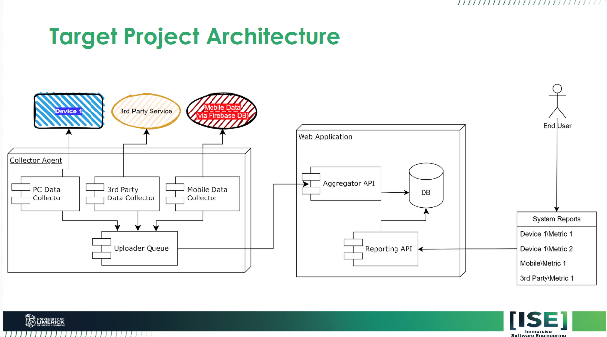

= CoTC & Mobile Dev joint project
:toc:
:toclevels: 2

== Overview
=== Resources
This project is a joint effort between two modules:

[cols="1,1"]
|===
| Module | Lecture Contents

| Context of the Code
| link:https://learn.ul.ie/d2l/le/lessons/72222/units/1128737[Lecture Contents]

| Mobile Application Development
| link:https://learn.ul.ie/d2l/le/lessons/72222/units/1128736[Lecture Contents]
|===

- 160126: link:https://learn.ul.ie/d2l/le/lessons/72222/topics/1155285[Project Specification Reference Architecture - SLIDE 37]
- 170126: link:https://www.notion.so/ise+--+y2+--+b3+--+project-2ebd3c352db0808cba36d812db65f04c?source=copy_link[Notion Page]

== Getting Started
This project utilizes Git submodules. To ensure all components are correctly initialized, clone the repository using:
----
git clone --recurse-submodules git@github.com:mikeyfennelly1/ise--y2--b3--project.git
----
If you have already cloned the repository without `--recurse-submodules`, you can initialize them by running:
----
git submodule update --init --recursive
----

== Running the Application
To run the application, you will need to have the directories installed. In future versions, the build process will include remote registries for automated deployments and releases.

Once the directories are installed, navigate to the root of the project and run the following command to start the services using Docker Compose:
----
docker-compose up
----

To produce system information, navigate to the `ise--y2--b3--project--desktop-sysinfo` directory and run the Go application.
----
# Example command, actual command might vary based on the Go application's build/run process
chmod +x ./ise--y2--b3--project--desktop-sysinfo/start.sh
./ise--y2--b3--project--desktop-sysinfo/start.sh
----

== Project Structure

The repository submodules are reflective of the architecture shown in the image. The uploader queue is preliminarily implemented using NATS. The submodules are as follows:

* link:https://github.com/mikeyfennelly1/ise--+y2+--+b3+--+project+--collector[Collector Agent]: The `ise--+y2+--+b3+--+project+--collector` submodule corresponds to the `Collector Agent` in the diagram.
* link:https://github.com/mikeyfennelly1/ise--+y2+--+b3+--+project+--desktop-sysinfo[Device 1]: The `ise--+y2+--+b3+--+project+--desktop-sysinfo` submodule corresponds to `Device 1` in the diagram.
* link:https://github.com/mikeyfennelly1/ise--+y2+--+b3+--+project+--mobile-app[Mobile Data (Firebase)]: The `ise--+y2+--+b3+--+project+--mobile-app` submodule corresponds to `Mobile Data (Firebase)` in the diagram. Although the `Mobile Data (Firebase)` labelling in the provided reference architecture does not include the mobile app, the provided and corresponding `mobile-app` submodule accounts for both the android source code for the mobile app and any firebase related scripts/configurations.
