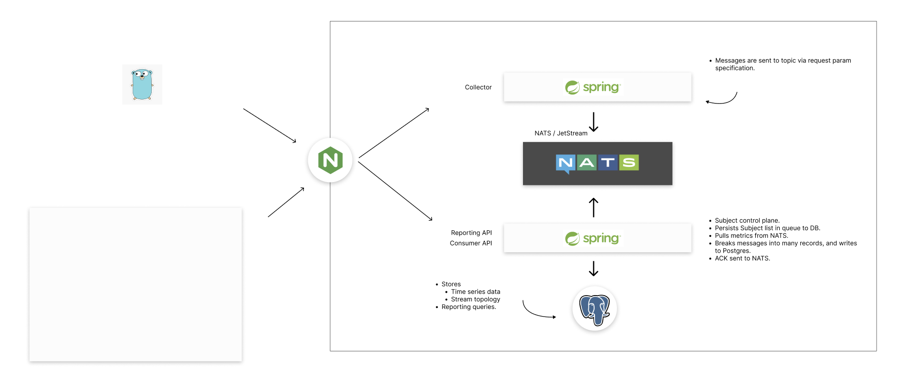

= CoTC & Mobile Dev joint project
:toc:
:toclevels: 3

== Overview

=== GitHub Repo Structure

The repository submodules are reflective of the architecture shown in the diagram below. The submodules are as follows:

* link:https://github.com/mikeyfennelly1/ise--y2--b3--project--collector[Collector Agent]: The `ise--y2--b3--project--collector` submodule corresponds to the `Collector Agent` in the diagram.
* link:https://github.com/mikeyfennelly1/ise--y2--b3--project--desktop-sysinfo[Device 1]: The `ise--y2--b3--project--desktop-sysinfo` submodule corresponds to `Device 1` in the diagram.
* link:https://github.com/mikeyfennelly1/ise--y2--b3--project--mobile-app[Mobile Data (Firebase)]: The `ise--y2--b3--project--mobile-app` submodule corresponds to `Mobile Data (Firebase)` in the diagram. Although the `Mobile Data (Firebase)` labelling in the provided reference architecture does not include the mobile app, the provided and corresponding `mobile-app` submodule accounts for both the android source code for the mobile app and any firebase related scripts/configurations.

=== Architecture

The system is composed of the following applications:

. *NGINX* - acting as an API gateway.
. *Collector* - acting as a frontend for producers in the system. This is used almost exclusively to produce messages to the queue.
. *NATS/Jetstream* - A durable message broker. This stores consumer ACK state, and messages.
. *web-app (Reporting API & Consumer API)* - Consumes messages from the queue, and manages the topology of streams.
. *PostgreSQL* - Used to store time series data, query that data, and persist the topological state of streams in the NATS queue.

== Getting Started

This project utilizes Git submodules. To ensure all components are correctly initialized, clone the repository using:

[source,bash]
----
git clone --recurse-submodules git@github.com:mikeyfennelly1/ise--y2--b3--project.git
----

If you have already cloned the repository without `--recurse-submodules`, you can initialize them by running:

[source,bash]
----
git submodule update --init --recursive
----

== Conventions & Standards

=== Operating System

All developers are expected to be running *Ubuntu*. This was agreed at the start of the project. Scripts use `readlink` (GNU coreutils) for path resolution, which behaves differently on macOS (BSD). While the scripts include a Darwin fallback, Ubuntu is the supported and expected development environment.

=== `start.sh` Contract

The root `./start.sh` orchestrates local development by delegating to each submodule's own `start.sh`. Every submodule is *required* to provide a `./start.sh` at its root. The root script calls each one inside a dedicated tmux pane:

[source]
----
./ (root)
├── start.sh                          # Starts NATS & Postgres, spawns tmux session
├── ise--y2--b3--project--collector/
│   └── start.sh                      # Checks NATS health, runs: ./gradlew bootRun
├── ise--y2--b3--project--web-app/
│   └── start.sh                      # Waits for Postgres, runs: ./gradlew bootRun
├── ise--y2--b3--project--web-gui/
│   └── start.sh                      # Runs: npm run dev
└── ise--y2--b3--project--desktop-sysinfo/
    └── start.sh                      # Runs: go run main.go producer ...
----

Each submodule `start.sh` is responsible for:

* Sourcing env vars from the root `.env.local` (or `.env`).
* Validating required env vars are set via `var_must_exist` (from `scripts/helpers.sh`).
* Performing any readiness checks on upstream dependencies (e.g. collector checks NATS, web-app polls Postgres).
* Starting the service.

If you are adding a new submodule, its `start.sh` must follow this same pattern or the root orchestration will break.

=== Environment Variables

Local env vars live in `.env.local` at the repo root and are sourced by each submodule's `start.sh`. This file is not committed — create it from the example if provided. Required variables per service are validated at startup; missing vars cause an immediate exit.

== Running the Applications

=== Local vs Remote

[cols="1,1,1", options="header"]
|===
| Component | Local | Remote (VM)

| NGINX
| *Not used.* Services are accessed directly on their ports.
| Used as an API gateway, routing requests to collector and web-app.

| Collector
| Runs directly via link:https://github.com/mikeyfennelly1/ise--y2--b3--project--collector/blob/main/start.sh[`./start.sh`], which invokes `./gradlew bootRun` to run the JAR in-process.
| Runs via Docker Compose, exposed through NGINX.

| web-app
| Runs directly via link:https://github.com/mikeyfennelly1/ise--y2--b3--project--web-app/blob/main/start.sh[`./start.sh`], which invokes `./gradlew bootRun` to run the JAR in-process.
| Runs via Docker Compose, exposed through NGINX.

| NATS/Jetstream
| Runs via Docker Compose.
| Runs via Docker Compose.

| PostgreSQL
| Runs via Docker Compose.
| Runs via Docker Compose.
|===

=== Prerequisites

. tmux
. Go
. Java 21
. Gradle
. Task (`go-task`)
. Ansible (for remote deployment)
. Docker & Docker Compose

=== Local Development

Run the following command:

[source,bash]
----
chmod +x ./start.sh
./start.sh
----

=== Building & Releasing Artifacts

Before deploying, build and push Docker images for the collector and web-app:

[source,bash]
----
task docker:release:dev
----

This runs in sequence:

. Builds the `libb3project` shared Java library.
. Builds and tags the `collector` Docker image.
. Builds and tags the `web-app` Docker image.

NOTE: Ensure you have run `task build` first to compile the Gradle projects and stage the JARs for Docker.

[source,bash]
----
task build
----

=== Deploying to the Remote VM

Deploy the latest configuration using Ansible:

[source,bash]
----
task deploy:latest
----

This runs the Ansible playbook at `ansible/deploy.yml` against the inventory defined in `ansible/inventory.ini`, using the vault password from `.vault_pass`.

For verbose output (useful for debugging):

[source,bash]
----
task deploy:latest:verbose
----
